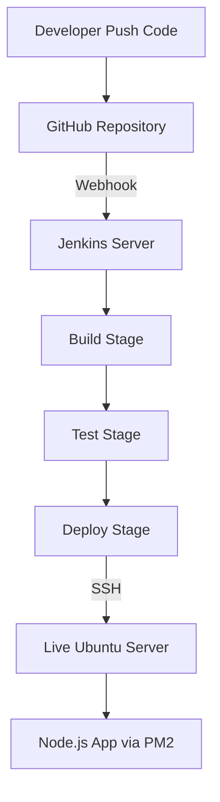
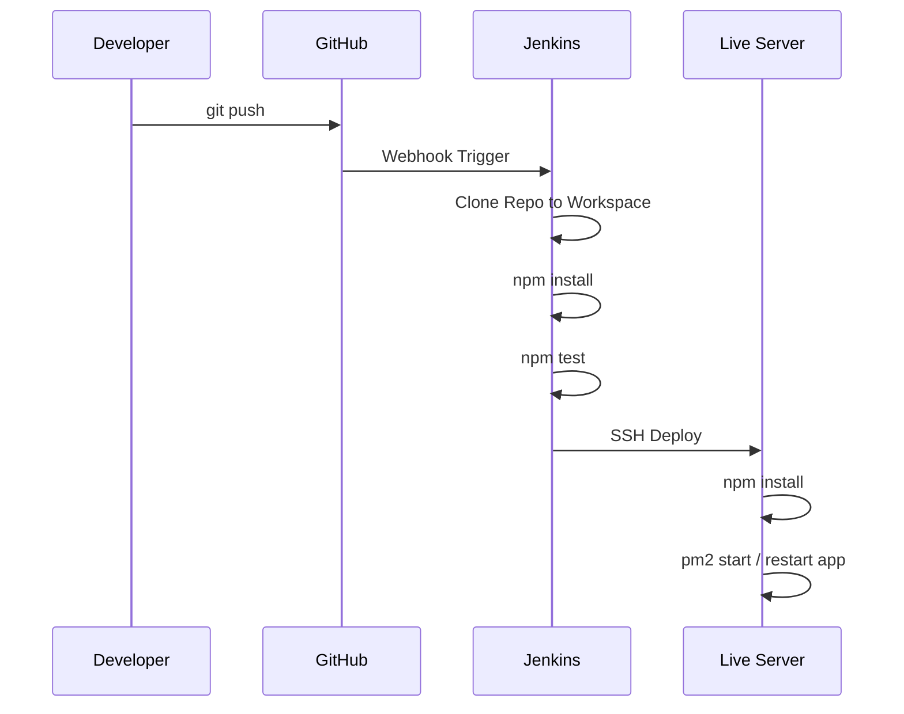
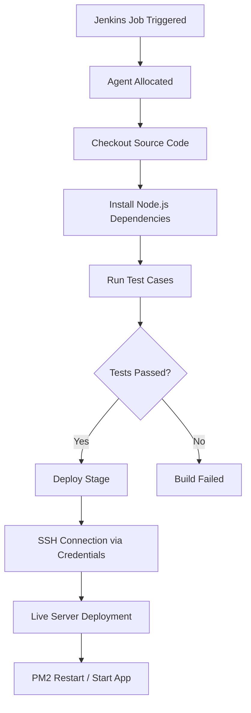

# 🚀 Jenkins CI/CD Pipeline for Node.js Application

An **ultra-professional, production-ready CI/CD project** demonstrating how to build, test, and deploy a **Node.js application** using **Jenkins**, **GitHub**, **SSH**, and **PM2** on a live Ubuntu server.

This project reflects **real-world DevOps practices** and is ideal for:
- ✅ DevOps / Cloud Freshers
- ✅ Jenkins interview preparation
- ✅ Portfolio & placement showcase

---
## 🎯 Project Objective:-

The goal of this project is to design and implement a **real-world CI/CD pipeline** using Jenkins for a Node.js application.

This pipeline ensures:
- Automated build, test, and deployment
- Zero manual intervention after code push
- Secure and repeatable deployments
- Production-grade DevOps workflow

## 📌 Project Highlights:-

- 🔄 Fully automated CI/CD pipeline
- 📦 Dependency management with NPM
- 🧪 Automated testing using Mocha
- 🚀 Secure deployment via Jenkins + SSH
- ♻️ Process management using PM2
- 🔐 Jenkins credentials & SSH Agent
- 🔔 GitHub Webhook based auto-trigger

---

## 🧩 Technology Stack:-

| Layer | Technology |
|------|------------|
| Source Control | GitHub |
| CI/CD Tool | Jenkins |
| Runtime | Node.js |
| Package Manager | NPM |
| Testing | Mocha |
| Process Manager | PM2 |
| Server | Ubuntu Linux |
| Auth | SSH (Key-based) |

---

## 🏗️ High-Level Architecture:-


## 📂 Repository Structure:-
```text
Jenkins-Node-App/
│
├── app.js
├── package.json
├── package-lock.json
├── test/
│   └── test.js
├── Jenkinsfile
└── README.md
```

## 🧭 End-to-End Workflow (Fully Automated):-

## 🌐Jenkins Internal Pipeline Flow:-

## 🔐 Create SSH Credential ID (Jenkins)

1. Jenkins Dashboard → **Manage Jenkins → Credentials**
2. **Global → Add Credentials**
3. Kind: **SSH Username with private key**
4. Username: `ubuntu`
5. Paste **private SSH key**
6. Credential ID: `My-Ubuntu`
7. Save

Used in Jenkinsfile:
```groovy
sshagent(['My-Ubuntu'])
```
## 🖥️ Create a Jenkins Node (Agent)

1. Jenkins → **Manage Jenkins**
2. **Manage Nodes and Clouds**
3. **New Node**
4. Enter Node name → Select **Permanent Agent**
5. Configure:
   - Remote root directory: `/home/jenkins`
   - Usage: **Use this node as much as possible**
   - Launch method: **Launch agents via SSH**
   - Host: `<AGENT_SERVER_IP>`
   - Credentials: **Select SSH credential ID**
6. Click **Save**


## ⚙️ Jenkins Server Setup:-

### 1️⃣ Install Jenkins:-
```bash
sudo apt update
```
```bash
sudo apt install openjdk-17-jdk -y
```
```bash
sudo apt install jenkins -y
```
```bash
sudo systemctl start jenkins
```

### 2️⃣ Required Jenkins Plugins:-

- Install from Manage Jenkins → Plugins:
  - Pipeline
  - Git
  - GitHub Integration
  - SSH Agent
  - NodeJS Plugin
  - Credentials Binding

### 3️⃣ Configure Global Tools:-

- Manage Jenkins → Global Tool Configuration
- NodeJS Name: mynode
- Install Automatically ✔️

## 🔐 SSH & Credentials Setup:-

- Add Credential in Jenkins
  - Type: SSH Username with private key
  - Credential ID: ```My-Ubuntu```
  - Username: ```ubuntu```


## 🌍 Live Server (Deployment Target):-

- ⚠️ IMPORTANT
- ❌ No commands are executed manually on the live server.
- ✅ All steps below are executed automatically by Jenkins during the Deploy stage:
```bash
sudo apt update
```
```bash
sudo apt install nodejs npm -y
```
```bash
sudo npm install -g pm2
```
```bash
git pull
```
```bash
npm install
```
```bash
pm2 start / restart
```

## 📦 File Locations:-

- Jenkins Server:-
```text
/var/lib/jenkins/workspace/JOB_NAME/
```
- Live Server:-
```text
/home/ubuntu/nodeapp/
```
## ⚡ Pipeline Syntax – Quick Steps

### 🔹 GitHub Repository Checkout
1. Open Jenkins job → **Pipeline Syntax**
2. Select **checkout: Check out from version control**
3. Choose **Git**
4. Enter repository URL and branch
5. Click **Generate Pipeline Script**
6. Paste the generated code into `Jenkinsfile`

---

### 🔹 SSH Agent (Live Server Access)
1. Open Jenkins job → **Pipeline Syntax**
2. Select **sshagent: SSH Agent**
3. Choose SSH credential ID
4. Click **Generate Pipeline Script**
5. Use the generated block inside the **Deploy stage**

---

### ✅ Result
- Jenkins clones code into workspace
- Jenkins connects securely to live server via SSH
- Build, test, and deployment are fully automated

📜 Complete Jenkinsfile:-
```groovy
pipeline {
    agent any

    tools {
        nodejs 'mynode'
    }

    stages {
        stage('Git Clone') {
            steps {
                checkout scmGit(
                    branches: [[name: '*/master']],
                    userRemoteConfigs: [[url: 'https://github.com/Prasad-bhoite19/Jenkins-Node-App.git']]
                )
            }
        }

        stage('Build') {
            steps {
                sh 'npm install'
            }
        }

        stage('Test') {
            steps {
                sh 'npm test'
            }
        }

        stage('Deploy') {
            steps {
                script {
                    sshagent(['My-Ubuntu']) {
                        sh '''
                        ssh -o StrictHostKeyChecking=no ubuntu@<LIVE_SERVER_IP> << 'EOF'
                        sudo apt update
                        sudo apt install -y nodejs npm
                        sudo npm install -g pm2

                        mkdir -p /home/ubuntu/nodeapp
                        cd /home/ubuntu/nodeapp

                          git init
                          git remote add origin https://github.com/Prasad-bhoite19/Jenkins-Node-App.git
                        
                        git pull origin master
                        npm install
                        pm2 restart app.js || pm2 start app.js
                        pm2 save
                        EOF
                        '''
                    }
                }
            }
        }
    }

    post {
        success {
            echo 'Pipeline executed successfully'
        }
        failure {
            echo 'Pipeline failed'
        }
    }
}
```
## 🔁 CI/CD Automation Principle:-

This project follows **true CI/CD automation** principles:

- ❌ No manual `git clone`
- ❌ No manual `npm install`
- ❌ No manual `node app.js`
- ✅ Everything is executed by Jenkins pipeline

**Single Trigger:**  
A `git push` to GitHub automatically starts the pipeline.

## 🧪 Testing Strategy:-

Automated testing is integrated into the pipeline using **Mocha**.

Testing occurs:
- After dependency installation
- Before deployment to production

This ensures:
- Only tested code reaches production
- Early detection of bugs

## 🔔 GitHub Webhook Configuration:-

- GitHub Repo → Settings → Webhooks
  
Payload URL:
```text
http://<JENKINS_URL>/github-webhook/
```
- Event:
  - Push events only

## 🛡️ Security Best Practices:-

- SSH key-based authentication
- Jenkins credentials masking
- No secrets in code
- Automated deployment only
 
## 🛠️ Common Errors & Fixes:-

| Error | Fix |
|------|-----|
| `MissingPropertyException` | Always run shell commands **inside `sh` block** in Jenkins pipeline |
| `EOF not found` | Ensure `EOF` is **not indented** and matches exactly in heredoc |
| `Exit code 1` | Add `set -e` at the top of shell script to stop pipeline on failure |

## 🏁 Final Summary:-

This project demonstrates:
- Real-world Jenkins usage
- End-to-end CI/CD automation
- Secure production deployment
- DevOps best practices

It is ideal for:
- DevOps fresher roles
- Cloud engineering interviews
- GitHub portfolio showcase

## 📈 Future Enhancements:-

- Docker integration
- AWS EC2 + Load Balancer
- Blue-Green deployment
- Monitoring & alerting

## 👨‍💻 Author:-
### Prasad Bhoite
Cloud & DevOps Engineer

## 📩 Connect With Me :-

If you’d like to collaborate, discuss projects, or just say hello — feel free to reach out!  

### 🔗 Social & Professional Links
- 🌐 [Portfolio Website](https://prasad-bhoite19.github.io/prasad-portfolio/)  
- 💼 [LinkedIn](http://linkedin.com/in/prasad-bhoite-a38a64223)  
- 🐙 [GitHub](https://github.com/Prasad-bhoite19)  
- ✉️ [Email](prasadsb2002@gmail.com)  

💬 Always open for opportunities in **Cloud, DevOps, and Full-Stack Projects**
